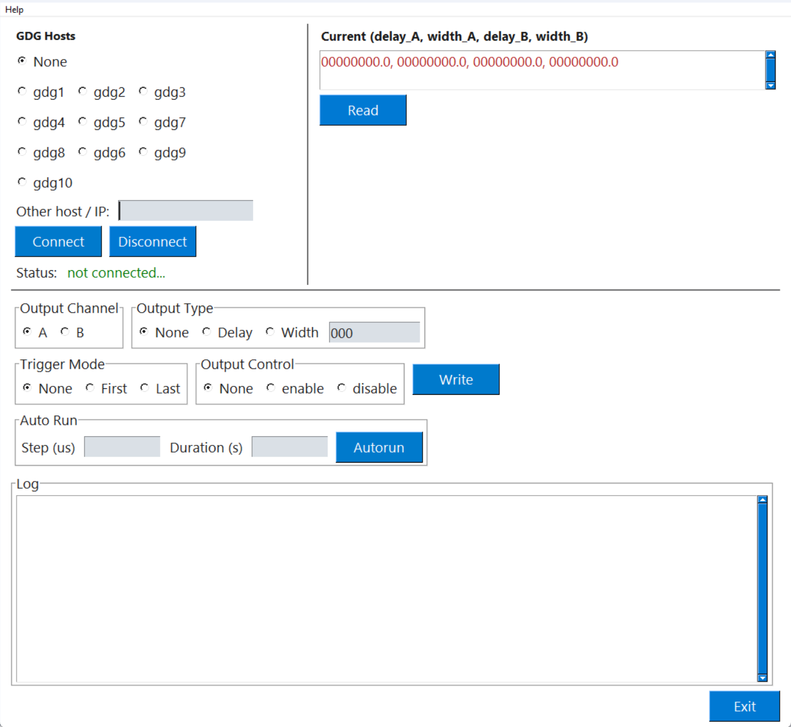

# A GUI program to control the 2 channel - GDG

GDG: Digital Gate Delay (by Tsuji Company, Japan (ツジ電子株式会社))
 
### Requirements

- Python: 3.12.x

This project uses the standard library `telnetlib` for controlling GDG devices. It has been developed and tested against Python 3.12.x; please run the code with a Python 3.12 interpreter. Newer Python versions remove `telnetlib`, which can break the telnet-based client.

### Installation

This project is developed against Python 3.12.x. If your team uses Astral's `uv` tool to manage Python versions, a common workflow to rebuild the development environment is:

```bash
uv sync

source .venv/bin/activate

python3 gui.py
```

## GUI usage (quick guide)

- Hosts: select a saved host radio button or type an IP/hostname in `Other host / IP` and press `Connect` to open a telnet session to the GDG device. The `Status` label shows connection state.
- `Read`: query the device for current settings; result is displayed in the large output area (`Current (delay_A, width_A, delay_B, width_B)`).
- `Output Channel`: choose `A` or `B` to target that channel for subsequent operations.
- `Output Type`: choose `Delay` or `Width` (or `None`) and enter a numeric value in the adjacent input (`inp_val`). Press `Write` to send the value to the device.
- `Trigger Mode`: `First` or `Last` (or `None`) — sets the channel trigger mode via `Write`.
- `Output Control`: `enable` or `disable` (or `None`) — toggles channel output via `Write`.
- `Auto Run`: enter `Step (us)` and `Duration (s)` then press `Autorun` to sweep the selected channel's delay in increments of `Step` and pause `Duration` seconds between steps.
- `Log`: the log panel shows client and command output messages for debugging and status monitoring.
- `Help -> version`: shows an About dialog with environment and version information.
- `Exit`: closes the application.

### GUI
